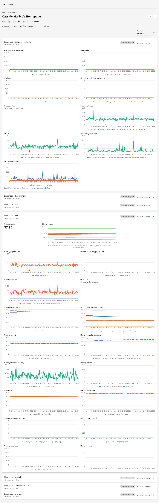
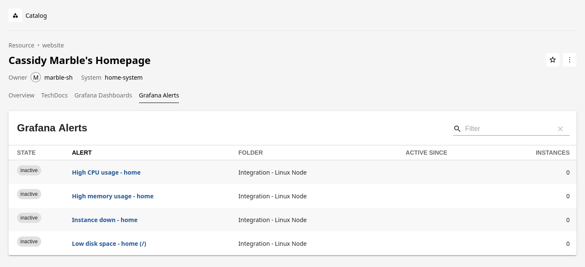

# @marble-sh/backstage-plugin-grafana

A read-only [Grafana](https://grafana.com/) frontend plugin for Backstage,
supporting **both** the legacy frontend system and the
[new frontend system](https://backstage.io/docs/frontend-system/).

It surfaces Grafana dashboards and alerts inside Backstage by talking to the
companion [`@marble-sh/backstage-plugin-grafana-backend`](../grafana-backend/README.md)
REST API — it never contacts Grafana directly, so all credentials and caching
stay in the backend.



## What it provides

| Feature                                     | Legacy system export             | New system extension                |
| ------------------------------------------- | -------------------------------- | ----------------------------------- |
| Standalone `/grafana` instances page        | `GrafanaPage`                    | `page:grafana`                      |
| Entity overview card: dashboards            | `EntityGrafanaDashboardsCard`    | `entity-card:grafana/dashboards`    |
| Entity overview card: alerts                | `EntityGrafanaAlertsCard`        | `entity-card:grafana/alerts`        |
| Entity tab (`/grafana`): dashboard graphs   | `EntityGrafanaDashboardsContent` | `entity-content:grafana/dashboards` |
| Entity tab (`/grafana-alerts`): alert table | `EntityGrafanaAlertsContent`     | `entity-content:grafana/alerts`     |
| API client for `/api/grafana/*`             | `grafanaApiRef`                  | `api:grafana`                       |

The overview **cards** stay lightweight: dashboards render with their tags and
a link to the containing folder (when the folder is known); alerts render with
a state chip colored by severity. In the new frontend system the entity cards
and tabs are only attached to entities that carry a relevant Grafana
annotation, so they never appear on unrelated entities.

### The dashboards tab renders real graphs

The **Grafana Dashboards** tab draws the selected dashboards' panels as live
charts, queried through the backend (which reads the dashboard model and
proxies Grafana's datasource query API — the browser never talks to Grafana):

- One expandable section per matched dashboard; the first is expanded, the
  rest fetch their panels lazily on expand. Each section links into Grafana.
- `timeseries` and legacy `graph` panels render as line charts; `stat`,
  `gauge`, and `singlestat` panels render as single-value tiles showing the
  latest value. Other panel types are counted and linked into Grafana.
- A shared time-range picker (15 minutes to 7 days, default 6 hours) and a
  refresh button re-query the visible panels (the refresh bypasses the
  backend's short panel cache).
- Dashboard template variables are resolved with their **dashboard default**
  values; targets whose datasource cannot be resolved (dashboard-default
  datasources, unset datasource variables) are skipped with a visible note.
- Charts draw at most 8 series, in a fixed colorblind-safe palette validated
  for both Backstage themes; a note points to Grafana when series are cut.

### The alerts tab is a live table



The **Grafana Alerts** tab lists the selected alert rules with their state and
health, how long they have been active, and the number of active instances —
each deep-linked to the rule in Grafana. The rule's `summary` annotation is
deliberately not shown: the rules API returns it as an unrendered Go template
(`{{ $values.B }}`…), which reads as noise in a table.

## Entity annotations

The plugin is driven entirely by five entity annotations. Each is optional;
what an entity displays is the result of combining the ones it carries.

| Annotation                     | Used by             | Value                                                             | Semantics                                                                                                                                                                                                                                        |
| ------------------------------ | ------------------- | ----------------------------------------------------------------- | ------------------------------------------------------------------------------------------------------------------------------------------------------------------------------------------------------------------------------------------------ |
| `grafana/instance`             | dashboards + alerts | An instance `name` from `grafana.instances`                       | Restricts every query to that single instance. Omit it to query **all** configured instances. The value must match a configured name exactly — an unknown name shows a `404 No Grafana instance configured with name '…'` error on the tab/card. |
| `grafana/dashboard-selector`   | dashboards          | Comma-separated title substrings, e.g. `payments, checkout`       | Case-insensitive substring match against the dashboard title; a dashboard is selected when **any** value matches.                                                                                                                                |
| `grafana/tag-selector`         | dashboards          | Comma-separated Grafana dashboard tags, e.g. `team-a, production` | Selects dashboards carrying **all** of the listed tags (tags match exactly).                                                                                                                                                                     |
| `grafana/dashboard-uid`        | dashboards          | A single dashboard uid                                            | Exact, **case-sensitive** match on the uid — at most one dashboard. Catalog discovery writes this onto every dashboard `Resource` it emits, so those entities show exactly their own dashboard; it can also be set by hand.                      |
| `grafana/alert-label-selector` | alerts              | `key=value,key2=value2`                                           | Selects alert rules whose labels contain **all** of the listed pairs (keys and values match exactly; whitespace around them is trimmed, segments without a `=` are ignored).                                                                     |

How the annotations combine:

- **The dashboard filters AND together.** A dashboard is shown only when it
  passes _every_ dashboard annotation the entity carries — e.g.
  `grafana/tag-selector: team-a` plus `grafana/dashboard-selector: payments`
  selects dashboards tagged `team-a` **whose title also contains** `payments`.
- **Within one annotation**, `grafana/dashboard-selector` values OR (any
  match), while `grafana/tag-selector` tags and `grafana/alert-label-selector`
  pairs AND (all must hold).
- **`grafana/instance` alone selects everything** on that instance: all of its
  dashboards and all of its alert rules. This is how the `grafana-instance`
  Resources emitted by catalog discovery behave.
- **Visibility gating:** the dashboards tab/card appears when the entity has
  any of `grafana/instance`, `grafana/dashboard-selector`,
  `grafana/tag-selector`, or `grafana/dashboard-uid`; the alerts tab/card
  appears with `grafana/instance` or `grafana/alert-label-selector`. Entities
  without Grafana annotations never show Grafana UI.
- **Empty values count as absent** — an annotation set to `''` neither gates
  nor filters.

> Migrating from the community plugin? These annotations look similar but
> behave differently — see
> [the differences section](#differences-from-backstage-communityplugin-grafana).

Example:

```yaml
apiVersion: backstage.io/v1alpha1
kind: Component
metadata:
  name: my-service
  annotations:
    grafana/instance: production
    grafana/tag-selector: team-a
    grafana/alert-label-selector: service=my-service
spec:
  type: service
  lifecycle: production
  owner: team-a
```

A complete example using all five annotations, with values validated against
a live Grafana Cloud stack, is in
[`docs/examples/catalog-info.yaml`](../../docs/examples/catalog-info.yaml).

## Installation

```sh
yarn --cwd packages/app add @marble-sh/backstage-plugin-grafana
```

No frontend configuration is required — all Grafana configuration lives in the
[backend plugin](../grafana-backend/README.md).

### New frontend system

With [feature discovery](https://backstage.io/docs/frontend-system/architecture/app/#feature-discovery)
the plugin is picked up automatically once installed. Otherwise, enable it
explicitly from the `/alpha` export:

```tsx
// packages/app/src/App.tsx
import grafanaPlugin from '@marble-sh/backstage-plugin-grafana/alpha';

export default createApp({
  features: [
    // ...
    grafanaPlugin,
  ],
});
```

### Legacy frontend system

Route the page and place the entity components where you want them:

```tsx
// packages/app/src/App.tsx
import { GrafanaPage } from '@marble-sh/backstage-plugin-grafana';

const routes = (
  <FlatRoutes>
    {/* ... */}
    <Route path="/grafana" element={<GrafanaPage />} />
  </FlatRoutes>
);
```

```tsx
// packages/app/src/components/catalog/EntityPage.tsx
import {
  EntityGrafanaAlertsCard,
  EntityGrafanaDashboardsCard,
  EntityGrafanaDashboardsContent,
} from '@marble-sh/backstage-plugin-grafana';
import { isGrafanaAvailable } from '@marble-sh/backstage-plugin-grafana-common';

// On the overview tab:
<EntitySwitch>
  <EntitySwitch.Case if={isGrafanaAvailable}>
    <Grid item md={6}>
      <EntityGrafanaDashboardsCard />
    </Grid>
    <Grid item md={6}>
      <EntityGrafanaAlertsCard />
    </Grid>
  </EntitySwitch.Case>
</EntitySwitch>

// As its own tab:
<EntityLayout.Route path="/grafana" title="Grafana" if={isGrafanaAvailable}>
  <EntityGrafanaDashboardsContent />
</EntityLayout.Route>
```

`isGrafanaAvailable`, `isDashboardsAvailable`, and `isAlertsAvailable` (from the
common package) are the gating helpers.

## Differences from `@backstage-community/plugin-grafana`

This suite is an independent, backend-centric reimplementation — not a fork. If
you are migrating from the community plugin, note these deliberate differences:

- **Architecture:** all Grafana traffic goes through the
  [backend plugin](../grafana-backend/README.md) (with caching and scheduled
  refresh) instead of the frontend proxy, so tokens are never visible to the
  browser and no `proxy` configuration is used.
- **`grafana/dashboard-selector` semantics:** in the community plugin this
  annotation is an expression language (`tags @> 'x' && title != 'y'`). Here it
  is a **comma-separated list of case-insensitive title substrings** — a
  dashboard is selected when its title matches _any_ value (e.g.
  `payments, checkout` selects both sets of dashboards). Tag-based selection
  uses the separate `grafana/tag-selector` annotation, whose comma-separated
  tags must _all_ be present.
- **Instance selection:** instances are addressed by the `grafana/instance`
  annotation against named entries in `grafana.instances`, rather than the
  community plugin's host-based configuration.
- **Graphs are rendered from data, not embedded.** The community plugin lists
  dashboards and alerts as links and can only embed a dashboard via an iframe
  (`grafana/overview-dashboard`, which requires the browser to reach Grafana).
  Here the dashboards tab draws the panels as real charts from data queried
  through the backend, and `grafana/overview-dashboard` is **not supported**
  (entities carrying it simply do not get an embed).

## FAQ

### Why do my dashboards only show "template variable '$…' has no saved value"?

Because the dashboard's template variables have no **saved** selection.
Grafana's own UI evaluates variables every time a dashboard loads (running
their queries and picking a value in the browser), so the stored dashboard
JSON routinely carries `current: null` for every variable. The backend can
only interpolate queries from what is stored — Grafana has no server-side
interpolation API — so a target that still references a valueless variable
is skipped with this warning rather than sent to the datasource, which would
reject the raw `$var` text with a parse error.

To fix it, save default values into the dashboard, per dashboard:

1. Open the dashboard in Grafana and pick a sensible value for every
   variable in the top bar (a concrete value, or "All" where enabled).
2. Save the dashboard with the **"Save current variable values as dashboard
   default"** checkbox ticked in the save dialog. This is what writes the
   selection into the stored JSON — a plain save does not.
3. Verify under Dashboard settings → **JSON Model**: every
   `templating.list[]` entry should now have a populated `current.value`.
   The entity tab picks the change up within the backend's ~30s model cache.

Caveats:

- **Provisioned dashboards can't be saved** (the stock Grafana Cloud and
  integration dashboards are provisioning-managed). Use **Save As** to make
  an editable copy — the copy stores your variable values — then select the
  copy from your entities (by tag or `grafana/dashboard-uid`).
- **"All" on a multi-value variable** interpolates to a pipe-joined regex
  (or the variable's custom `allValue`). That is valid inside regex matchers
  like `{job=~"$job"}` but invalid PromQL in unquoted positions (metric
  names, `by ($var)`) — exactly as in Grafana's own UI. For those, save a
  single value or set an `allValue` that is valid where the variable is
  used.
- **Interval variables on "Auto"** and **datasource variables** need no
  saved value: the backend substitutes the computed query interval for
  `$__auto_interval_*`, and defaults a valueless datasource variable to the
  instance's first datasource of the variable's declared type. A saved
  selection always wins over these defaults.

### Why does a panel warn "its datasource could not be resolved"?

The target's datasource reference cannot be mapped to a queryable datasource
of the instance. Most commonly the panel selects its datasource through a
datasource-type variable whose declared plugin type has no match in
`GET /api/datasources` — including app-plugin datasources (for example
`grafana-incident-datasource`), which Grafana does not expose through that
API at all; such panels cannot be queried from outside the Grafana frontend.

### Why does a query fail with `parse error: unexpected character '|'`?

A multi-value variable selection was interpolated into a position where a
pipe-joined value is not valid query syntax (see the "All" caveat above).
The interpolated text matches what Grafana's own frontend would produce for
that saved selection — the panel is broken for that selection in the Grafana
UI too. Save a single value, or set a custom `allValue`.

## Local development

```sh
yarn start   # from this directory, serves the plugin in isolation
```

## Testing

```sh
yarn workspace @marble-sh/backstage-plugin-grafana test
```

Component tests use `@backstage/frontend-test-utils` with a mocked
`grafanaApiRef`; the legacy extensions are rendered with
`@backstage/test-utils`; the new-system extensions are exercised through
`createExtensionTester` (filters, loaders, and the API factory); and the API
client is unit-tested against mock discovery/fetch APIs.
